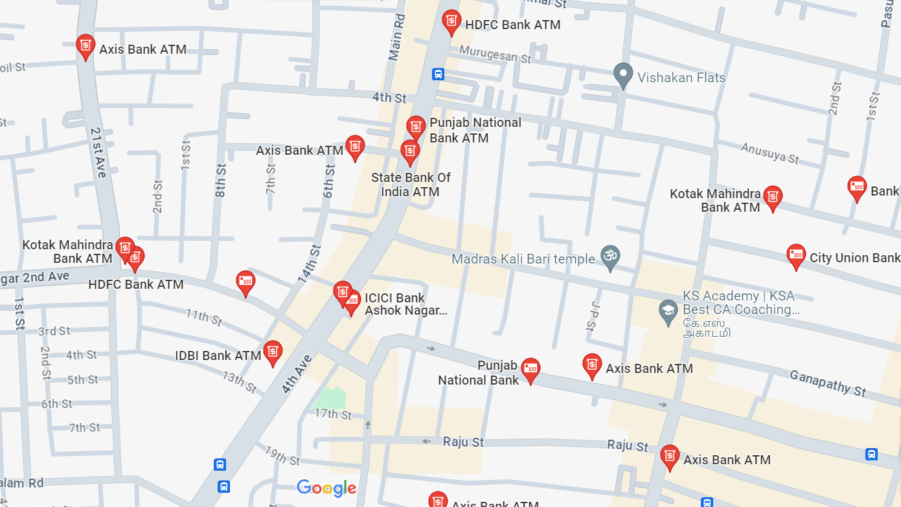
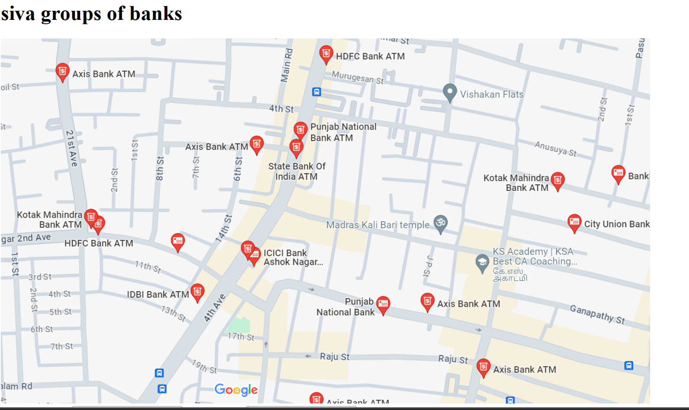
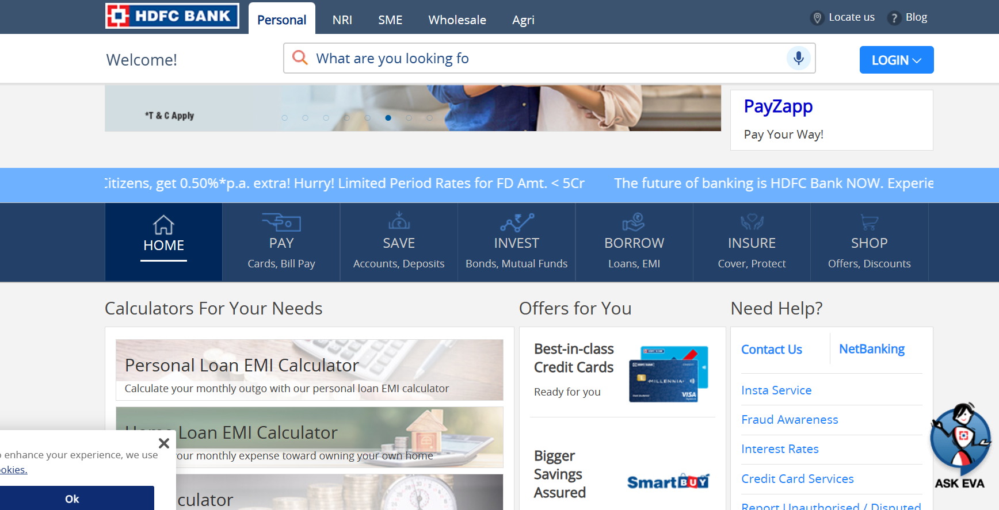
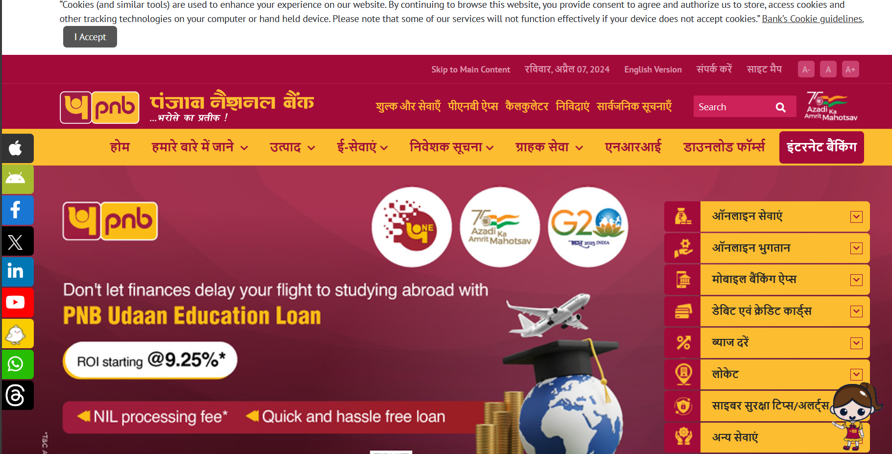

# Ex04 Places Around Me
## Date: 

## AIM
To develop a website to display details about the places around my house.

## DESIGN STEPS

### STEP 1
Create a Django admin interface.

### STEP 2
Download your city map from Google.

### STEP 3
Using ```<map>``` tag name the map.

### STEP 4
Create clickable regions in the image using ```<area>``` tag.

### STEP 5
Write HTML programs for all the regions identified.

### STEP 6
Execute the programs and publish them.

## CODE


<!DOCTYPE html>

<html lang ="en">

<head>

    <meta charset="UTF-8">

    <meta name="viewport" content="width=device-width, initial-scale=1.0">

    <title>Document</title>

</head>

<body>

    <script>

        function coordinate(event) 

        {

           let x = event.clientX;

           let y = event.clientY;

           document.getElementById("text1").value = x;

           document.getElementById("text2").value = y;

        }

    </script>
    
    
    
    
    <h1>BANKS</h1>


    
 <br>

<MAP name="MapNew">

    <AREA shape="RECT" coords="400,322,494,363" href="https://www.icicibank.com/" Title="icici bank">

    <AREA shape="RECT" coords="670,396,775,429" href="https://www.axisbank.com/" Title="axisbank">

    <AREA shape="RECT" coords="518,402,596,438" href="https://www.pnbindia.in/" Title="punjab national bank">

    <AREA shape="RECT" coords="218,395,300,420" href="https://www.idbibank.in/" Title="idbi bank">

    <AREA shape="RECT" coords="130,294,211,339" href="https://www.hdfcbank.com/" title="HDFC bank">
>
</MAP>

X Co-ordinate <input type="text" name="" id="text1">

Y Co-ordinate <input type="text" name="" id="text2">

</MAP>

</body>

</html>


## OUTPUT








## RESULT

The program for implementing image maps using HTML is executed successfully.
